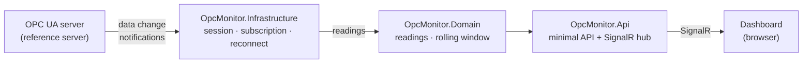

# opc-ua-monitor

Real-time monitoring for industrial OPC UA servers. A .NET 8 service subscribes
to nodes on an OPC UA server and streams value changes over SignalR to an Angular
dashboard that updates live. It handles the parts that make OPC UA awkward in
practice: application certificate trust, endpoint advertisement inside
containers, session reconnection with automatic resubscription, and data-change
subscriptions instead of polling.


---

## Quickstart — no Docker, against a public server

Two terminals, and it runs against a public OPC UA demo server on the internet,
so there is nothing to install beyond the two SDKs.

```bash
git clone https://github.com/<you>/opc-ua-monitor
cd opc-ua-monitor

# terminal 1 — the service
ASPNETCORE_ENVIRONMENT=Remote dotnet run --project src/OpcMonitor.Api

# terminal 2 — the dashboard
cd web && npm ci && npm start
```

Then open <http://localhost:4200>.

Requires the .NET 8 SDK and Node 20+. The `Remote` profile talks to
`opc.tcp://opcuademo.sterfive.com:26543`, so it needs outbound TCP 26543 — and
because it is somebody else's server, it can be down or busy.

The API alone is usable without the dashboard:

```bash
curl http://localhost:8080/health          # OPC session state, not just liveness
curl http://localhost:8080/api/nodes       # every monitored node, current value + window
curl http://localhost:8080/api/browse      # walk the server's address space
```

### Docker Compose

`docker-compose.yml` defines the OPC Foundation reference server, the API and a
network joining them:

```bash
docker compose up
```

The simulator's `hostname:` is pinned to its service name so the endpoint URLs
it advertises resolve inside that network, and the API is published on 8080.

---

## The dashboard

Dense on purpose, and dark because it is meant to sit on a screen someone
glances at rather than reads.

The OPC session dropped — attempt, elapsed time, the server's own error and a
live countdown to the next retry:


The dashboard's own socket dropped, which is a different failure with a
different remedy. The values are held rather than blanked, and labelled as held:


- **Live value per node**, with its engineering unit, its source timestamp to the
  millisecond, and how long ago that was. Values are monospaced and
  tabular-figured so digits do not jitter as they change, and the type size steps
  down for long values rather than clipping them.
- **A trend chart per node**, plus a larger one for the selected node. Charts
  autoscale to the data, shade the configured band behind it, and break the line
  across gaps instead of drawing through them.
- **Two connection states, both stated.** The browser's socket to the API and the
  API's session to the OPC server are separate things that fail separately, so
  the header shows both. During a reconnect the attempt number, the elapsed
  time, the server's own error text and a countdown to the next retry are all on
  screen — the backoff is the interesting part and it is not hidden behind a
  spinner.
- **Address-space browsing**, one level at a time, with each level's current
  values read as it is fetched. Press `+` on a variable to start monitoring it
  and `−` to stop; both take effect immediately and survive a reconnect.
- **Quiet, not stale.** A node that has not changed in two minutes is flagged as
  quiet rather than broken, because a data-change subscription reporting nothing
  about a constant tag is correct behaviour, not a fault.

---

## Architecture



Data flows one way. `OpcMonitor.Domain` has no package references at all;
`OpcMonitor.Infrastructure` is the only project that knows OPC UA exists;
`OpcMonitor.Api` knows about HTTP and SignalR but nothing about the protocol;
`web` knows only the wire contract.

The hub pushes four messages. `web/src/app/core/hub-client.ts` registers a
handler for each of them; `web/src/app/core/api.types.ts` holds the shapes they
carry:

| Message | Carries |
|---|---|
| `SnapshotReceived` | Everything: nodes, current values, windows, connection state. Sent on connect. |
| `ReadingsUpdated` | A batch of value changes, coalesced over a 100 ms window. |
| `ConnectionStateChanged` | OPC session state, reconnect attempt and the reason. |
| `NodesChanged` | The monitored node set, after a subscribe, unsubscribe or reconnect. |

---

## How it works

- **Subscriptions, not polling.** The server samples each node and pushes only
  changes, so traffic scales with how often values move rather than with how
  many nodes are watched. An optional absolute deadband suppresses noise on
  analogue signals server-side.

- **Reconnect with backoff, jitter and resubscribe.** When the session drops,
  the client rebuilds session, node resolution and subscription from scratch on
  an exponential backoff with symmetric jitter. One path, always exercised —
  rather than a subscription-transfer fast path plus a rebuild fallback that is
  the least-tested code in the system.

- **The security policy is settled by trying it.** The client ranks the
  endpoints a server advertises strongest-first and opens a session on the first
  that completes a handshake. A server can advertise a policy its deployment then
  refuses — an unregistered client certificate, or an algorithm one side does not
  implement — and that only surfaces at channel open, after the endpoint has been
  chosen. Each failed policy is logged. The unsecured endpoint is in the list
  only when `Opc:AllowNoSecurityFallback` allows it, and connecting over it logs
  a warning of its own.

- **Current values on resubscribe.** A data-change subscription reports changes,
  so a node that is stable when you attach reports nothing until it happens to
  move. Every subscribe is followed by an explicit read of all monitored nodes,
  so the dashboard is populated within a second of connecting — on first start
  and after every reconnect.

- **Snapshot on connect.** The hub sends a browser its full state — nodes,
  current values, rolling window, connection status — the moment it connects, so
  the first paint is never empty.

- **The container endpoint trap, handled twice.** An OPC UA server advertises
  endpoint URLs built from its own hostname. In Compose that is the container
  id, which resolves nowhere. The compose file pins the simulator's `hostname:`
  to match, *and* the client keeps the host and port it actually connected to
  rather than the advertised one — because a server you do not control will not
  have had the first fix applied. See `EndpointUrlRewriter`.

- **Certificate trust is explicit.** A self-signed application instance
  certificate is generated on first run into a gitignored `pki/` directory.
  Accepting an untrusted server certificate is a flag that defaults to off in
  code and is turned on by the `appsettings.json` here, which applies to every
  profile in this repository — they point at a simulator or at a public demo
  server. Every acceptance is logged as a warning with the certificate's
  subject and thumbprint, and a rejection logs the trusted store to copy it
  into.

- **Subscription lifetimes are computed, not guessed.** The lifetime count is
  raised to satisfy both the spec's three-keep-alive minimum and the session
  timeout, which is a common way a client appears to work and then quietly stops
  delivering.

- **No database.** An in-memory bounded window per node is enough for a live
  monitor, and an OPC UA server's own historical access does long-term storage
  better than a bolted-on table would.

- **Health means connected.** `/health` reports the OPC session state, so a
  container healthcheck on it is meaningful. Reconnecting is reported as
  degraded rather than unhealthy — restarting a container mid-backoff makes
  recovery slower, not faster.

- **Nodes can be added and dropped at runtime.** A node subscribed from the
  dashboard is attached to the existing subscription rather than triggering a
  rebuild, and it is held in a registry that the reconnect path resolves from —
  so it comes back after a dropped session instead of quietly vanishing. The
  registry is in memory only: a restart returns to the configured set, because a
  dashboard experiment should not become permanent state.

- **Browsing is lazy and reads as it goes.** `GET /api/browse` returns one level
  of the address space with the current value of every variable on it, in one
  batched read. Finding a tag is only half the problem; knowing which of six
  similar names is the live one is the other half.

---

## Pointing it at a different server

The endpoint is configuration. Three profiles ship with the API:

| Profile | Endpoint | Use |
|---|---|---|
| default (`appsettings.json`) | `opc.tcp://simulator:62541` | Docker Compose |
| `Local` | `opc.tcp://localhost:62541` | API on the host, simulator in Docker |
| `Remote` | `opc.tcp://opcuademo.sterfive.com:26543` | public demo server, no Docker at all |

```bash
ASPNETCORE_ENVIRONMENT=Remote dotnet run --project src/OpcMonitor.Api
```

Or override anything without touching a file:

```bash
Opc__EndpointUrl=opc.tcp://192.0.2.10:4840 dotnet run --project src/OpcMonitor.Api
```

The `Remote` profile talks to a public server on the internet: it needs outbound
TCP 26543, it can be down or busy, and it only offers an unsecured endpoint. It
is the profile everything here has actually been verified against.

The dashboard's own idea of where the API is follows the same principle. It is
read at runtime from one line of `index.html`:

```html
<meta name="opc-api-base" content="http://api.example.internal:8080" />
```

Left empty it uses the origin the page came from, which is the right answer when
a reverse proxy fronts both. Nothing about the endpoint is compiled into the
bundle either.

### Choosing which nodes to watch

Nodes are configured under `Opc:Nodes`, and each address is either a node id or
a browse path:

```json
{ "Address": "i=2258",                            "DisplayName": "Server time" }
{ "Address": "Server/ServerStatus/CurrentTime",   "DisplayName": "Server time" }
{ "Address": "Tank/TankLevel", "Unit": "m", "Minimum": 0, "Maximum": 1 }
```

Browse paths are resolved against the live server at startup. They are worth
preferring because namespace indices are assigned per server, so an
`ns=2;s=Something` copied from one server does not necessarily mean the same
thing on another. Nodes that do not resolve are skipped with a warning unless
marked `"Required": true`, so one config can list nodes for several servers.

The defaults use only nodes that OPC UA requires every compliant server to
expose, so the demo shows live data whatever you point it at.

---

## Finding out what a server actually exposes

`opcprobe` is a small command-line tool that connects, prints the endpoint and
security it negotiated, dumps the address space with live values, and can tail a
subscription. When the dashboard is blank, this tells you in ten seconds whether
the problem is OPC UA or everything downstream of it.

```bash
dotnet run --project tools/OpcMonitor.Probe -- \
  --endpoint opc.tcp://opcuademo.sterfive.com:26543 --no-security --depth 1
```

```
  endpoint      opc.tcp://opcuademo.sterfive.com:26543
  applicationUri urn:localhost:OpcMonitor:Probe

18:39:46 info: OpcMonitor.Infrastructure.OpcSessionFactory[0] Building OPC UA client configuration. ApplicationUri=urn:localhost:OpcMonitor:Probe PkiRoot=D:\repo\opc-ua-monitor\tools\OpcMonitor.Probe\bin\Debug\net8.0\pki
18:39:47 info: OpcMonitor.Infrastructure.OpcSessionFactory[0] Application instance certificate ready. Subject=CN=OpcMonitorProbe, O=OpcMonitor, C=US Thumbprint=41F7DAFED0C1B332AC5155C4CB2E41201C113944 NotAfter=2028-08-13 19:00:00Z
18:39:48 warn: OpcMonitor.Infrastructure.OpcSessionFactory[0] Connecting to opc.tcp://opcuademo.sterfive.com:26543 over an UNSECURED endpoint (SecurityMode=None). Acceptable against a simulator, never in production.
18:39:48 info: OpcMonitor.Infrastructure.OpcSessionFactory[0] Opening session to opc.tcp://opcuademo.sterfive.com:26543/ with SecurityMode=None Policy=http://opcfoundation.org/UA/SecurityPolicy#None
18:39:49 info: OpcMonitor.Infrastructure.OpcSessionFactory[0] Session established. SessionId=ns=1;g=aa4293bc-b740-66ed-f606-c70f908d3afc Server=urn:opcuademo.sterfive.com:NodeOPCUA-Server-for-CTT
Connected.
  session       OpcMonitorProbe:44180
  server        urn:opcuademo.sterfive.com:NodeOPCUA-Server-for-CTT
  endpoint used opc.tcp://opcuademo.sterfive.com:26543/
  security      None / None
  namespaces    18
                ns=0 http://opcfoundation.org/UA/
                ns=1 urn:opcuademo.sterfive.com:NodeOPCUA-Server-for-CTT
                ns=2 http://opcfoundation.org/UA/DI/
                ns=3 http://opcfoundation.org/UA/ADI/
                ns=4 http://opcfoundation.org/UA/AutoID/
                ns=5 http://opcfoundation.org/UA/MachineVision
                ns=6 http://opcfoundation.org/UA/Robotics/
                ns=7 http://opcfoundation.org/UA/CommercialKitchenEquipment/
                ns=8 http://opcfoundation.org/UA/ISA95-JOBCONTROL_V2/
                ns=9 http://opcfoundation.org/UA/Dictionary/IRDI
                ns=10 http://opcfoundation.org/UA/IA/
                ns=11 http://opcfoundation.org/UA/Machinery/
                ns=12 http://opcfoundation.org/UA/Machinery/Jobs/
                ns=13 http://opcfoundation.org/UA/MachineTool/
                ns=14 http://opcfoundation.org/UA/PackML/
                ns=15 http://opcfoundation.org/UA/WoT-Con/
                ns=16 urn://node-opcua-simulator
                ns=17 http://sterfive.com/UA/CoffeeMachine/

Address space:
  Locations                    i=31915
  Server                       i=2253
  Aliases                      i=23470
  DeviceSet                    ns=2;i=5001
  NetworkSet                   ns=2;i=6078
  DeviceTopology               ns=2;i=6094
  Machines                     ns=11;i=1001
  PackMLObjects                ns=14;i=72
  WoTAssetConnectionManagement ns=15;i=31
  Simulation                   ns=16;s=SimulationFolder
  HistoryExamples              ns=1;i=1000
  AutoIdDemo                   ns=1;i=1738
  PressureVessel               ns=1;i=1739
  Tank                         ns=1;i=1755
  MyDevices                    ns=1;i=1967
  Matrix                       ns=1;s=Matrix                      = [1, 2, 3, 4, 5, 6, 7, 8, … (9 items)]
  Position                     ns=1;s=Position                    = [1, 2, 3, 4]
  Boiler#1                     ns=1;i=2061
  Boiler#2                     ns=1;i=2107
  FolderDemo                   ns=1;i=2289
18:39:50 info: OpcMonitor.Infrastructure.NodeResolver[0] Resolved Server/ServerStatus/CurrentTime -> i=2258 (Server time)
18:39:50 info: OpcMonitor.Infrastructure.NodeResolver[0] Resolved Server/ServerStatus/State -> i=2259 (Server state)
18:39:51 info: OpcMonitor.Infrastructure.NodeResolver[0] Resolved Server/ServerStatus/StartTime -> i=2257 (Server start time)

Configured nodes:
  Server time                  = 08/16/2026 23:39:50
  Server state                 = 0
  Server start time            = 08/16/2026 17:24:48
```

`--no-security` goes straight to the unsecured endpoint. Without it, the probe
tries the six secure endpoints this particular server advertises, gets a
handshake refusal on each, logs them and arrives at the same place a few seconds
later.

Deeper, and tailing a subscription rather than reading once:

```bash
dotnet run --project tools/OpcMonitor.Probe -- \
  --endpoint opc.tcp://localhost:62541 --depth 3

dotnet run --project tools/OpcMonitor.Probe -- \
  --endpoint opc.tcp://localhost:62541 --watch 15
```

It uses the same session, resolver and subscription code as the service, so a
result here is evidence about the real pipeline rather than about a parallel
implementation written for the tool.

---

## Project layout

```
src/OpcMonitor.Domain           readings, quality, rolling window — zero package references
src/OpcMonitor.Infrastructure   the only project referencing the OPC UA SDK
src/OpcMonitor.Api              .NET 8 minimal API, SignalR hub, hosted service
web                             Angular 20 dashboard, standalone + signals, zoneless
tools/OpcMonitor.Probe          command-line diagnostic client
tests/OpcMonitor.Tests          domain, endpoint policy, reconnect policy, mapping
```

`web/package.json` lists eight runtime dependencies: five `@angular/*`
packages, the `rxjs` and `tslib` those require, and `@microsoft/signalr`. There
is no chart library — the trend plots are hand-drawn SVG, which is
a smaller thing to own than a charting dependency used for exactly one chart
type, and it renders identically at every size the same geometry is reused at.

There is no `NuGet.config` in this repository, deliberately. Everything restores
from nuget.org, and CI proves it on a clean runner.

---

## Development

```bash
dotnet build -c Release
dotnet test

# run the API against the public demo server, no Docker needed
ASPNETCORE_ENVIRONMENT=Remote dotnet run --project src/OpcMonitor.Api

# the dashboard, with live reload
cd web && npm ci && npm start
```

Requires the .NET 8 SDK and Node 20+.

The dev server runs on port 4200 and the API on 8080, which are different
origins — the API's CORS policy allows both loopback spellings of `:4200` and
nothing else by default. Set `Cors:AllowedOrigins` to change that.

The API's port comes from `src/OpcMonitor.Api/Properties/launchSettings.json`
under `dotnet run`, and from `ASPNETCORE_HTTP_PORTS` in the container. Both say
8080, which is also what the dashboard assumes when it is served from the dev
server on 4200 (`web/src/app/core/api-base.ts`).

`pki/` is generated on first run and is gitignored. Application instance
certificates embed a hostname in their subject alternative names, and this one is
pinned to `localhost` precisely so that it is not the machine's:
`Opc:ApplicationUri` is set in `appsettings.json` and `Opc:CertificateDomainNames`
defaults to `localhost` in `OpcClientOptions`, rather than either being left to
the SDK, which fills them from `Dns.GetHostName()`. Both can be overridden in
configuration.

CI runs on pushes to `main`, on every pull request, and on demand: a secret scan
over the working tree and the full history, restore, build, test, an
`npm ci && npm run build` of the dashboard, and a `docker compose build`.

---

## License

MIT — see [LICENSE](LICENSE).

Built on the OPC Foundation's [UA-.NETStandard](https://github.com/OPCFoundation/UA-.NETStandard)
client SDK (`OPCFoundation.NetStandard.Opc.Ua.Client` and
`.Configuration`), used under its own license. The bundled simulator is the OPC
Foundation reference server container image.
